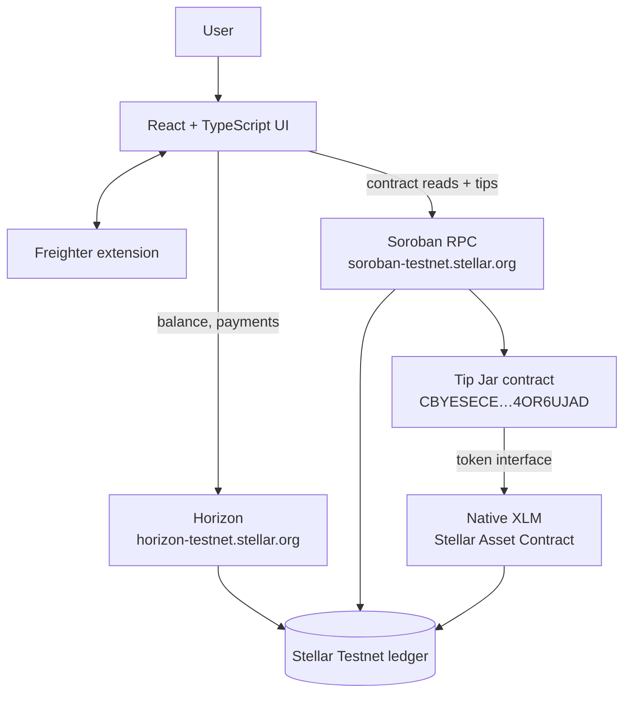
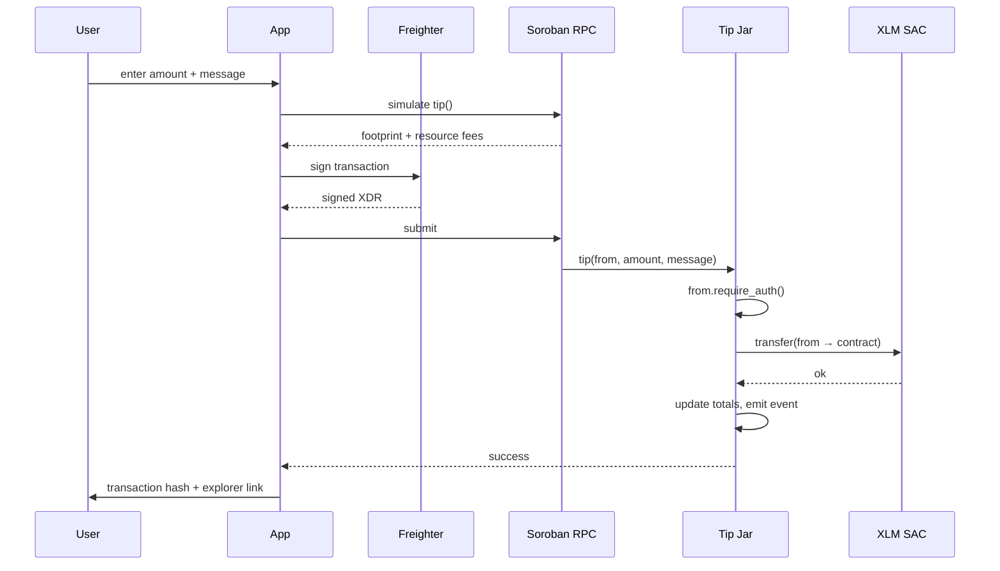

# Stellar Pay

**A Stellar testnet dApp with a Soroban smart contract.** Connect a Freighter wallet, read your XLM
balance, send payments — and tip a Rust smart contract deployed on-chain.

[](https://stellar-pay-omega.vercel.app)
[](https://stellar.expert/explorer/testnet)
[](https://stellar.expert/explorer/testnet/contract/CBYESECEZHDVCZ6ZLAYXDBAFZO7Z67L256JUTNYZ2TJFCDUO4OR6UJAD)
[](#testing)
[](#license)

> Built for the **Stellar Frontend Challenge — Level 1 (White Belt)**, then taken past the brief with
> a Soroban contract.

---

## Table of contents

- [What this is](#what-this-is)
- [Live links](#live-links)
- [Architecture](#architecture)
- [Features](#features)
- [The smart contract](#the-smart-contract)
- [Quickstart](#quickstart)
- [Scripts](#scripts)
- [Testing](#testing)
- [Deployment](#deployment)
- [Project structure](#project-structure)
- [Design decisions](#design-decisions)
- [Troubleshooting](#troubleshooting)
- [License](#license)

---

## What this is

Stellar has two distinct halves, and most beginner projects only touch one. This app does both:

1. **Classic Stellar** — payments built as `payment` / `createAccount` operations, submitted through
   Horizon. Fast, cheap, no contract involved.
2. **Soroban** — a smart contract written in Rust, compiled to WebAssembly, deployed to testnet, and
   invoked from the browser through Soroban RPC.

Every transaction is real and permanently recorded on the Stellar testnet. No mocks, no simulated
wallet. No real funds are ever at risk — testnet XLM comes free from the Friendbot faucet.

---

## Live links

| | |
| --- | --- |
| **Repository** | <https://github.com/koustavx08/stellar-pay> |
| **Contract** | [`CBYESECEZHDVCZ6ZLAYXDBAFZO7Z67L256JUTNYZ2TJFCDUO4OR6UJAD`](https://stellar.expert/explorer/testnet/contract/CBYESECEZHDVCZ6ZLAYXDBAFZO7Z67L256JUTNYZ2TJFCDUO4OR6UJAD) |
| **Network** | Stellar Testnet |
| **Live app** | **<https://stellar-pay-omega.vercel.app>** |

---

## Architecture



Two independent paths to the same ledger:

- **Payments** go `PaymentForm` → `src/lib/stellar.ts` → Horizon. The transaction is built locally,
  signed by Freighter, submitted, and the result mapped to a readable message.
- **Tips** go `TipJarPanel` → `src/lib/tipjar.ts` → Soroban RPC → the contract. Reads are simulated
  (free, no signature); writes are simulated to compute the footprint, then signed and submitted.

---

## Features

| Capability | How it works |
| --- | --- |
| **Wallet connect** | `requestAccess()` prompts Freighter; an already-approved session is restored silently on reload |
| **Wallet disconnect** | Clears the session and stops all wallet reads — remembered across reloads, so the app never silently re-connects |
| **Network guard** | Detects the wallet's network and disables sending unless it is Testnet |
| **Balance** | Native XLM read from Horizon, with unfunded accounts detected and a one-click Friendbot faucet |
| **Spendable amount** | Shows balance minus the 1 XLM base reserve, so the number you see is the number you can actually send |
| **Send XLM** | Builds, signs and submits a payment — switching to `createAccount` when the destination does not exist yet |
| **Tip the contract** | Invokes `tip()` on the deployed Soroban contract, moving real XLM into it |
| **Contract stats** | Total tipped, tip count, jar balance, latest message and your own contribution, read live from chain |
| **Transaction feedback** | Live stage labels, then a success panel with the transaction hash and an explorer link — or a plain-English failure |
| **Error handling** | Horizon result codes and Soroban contract error codes both translated to readable text |

---

## The smart contract

A tip jar that holds XLM and remembers who gave what.

Source: [`contracts/tip-jar/src/lib.rs`](contracts/tip-jar/src/lib.rs)

| | |
| --- | --- |
| **Contract ID** | [`CBYESECEZHDVCZ6ZLAYXDBAFZO7Z67L256JUTNYZ2TJFCDUO4OR6UJAD`](https://stellar.expert/explorer/testnet/contract/CBYESECEZHDVCZ6ZLAYXDBAFZO7Z67L256JUTNYZ2TJFCDUO4OR6UJAD) |
| **Token** | Native XLM Stellar Asset Contract — [`CDLZFC3S…CYSC`](https://stellar.expert/explorer/testnet/contract/CDLZFC3SYJYDZT7K67VZ75HPJVIEUVNIXF47ZG2FB2RMQQVU2HHGCYSC) |
| **Owner** | [`GAH4EEJN…JTJN`](https://stellar.expert/explorer/testnet/account/GAH4EEJN6KQWZR33W4XMOWWGWH5JCANMJQ7PK72JL35MMJZ5PL5JJTJN) — the only address that can `withdraw` |
| **Wasm hash** | `8d903ba4d9844d4a54f17441e21f39d41237e6744d85c4f0a14d1eee101646f4` |
| **Wasm size** | 14,674 bytes |
| **SDK** | `soroban-sdk` 27.0.6, built for `wasm32v1-none` |

Deploy transactions:
[upload](https://stellar.expert/explorer/testnet/tx/e5feccfbb745b5aef85b4f50024a506a569297ef50584808fd811df3b886c071) ·
[create](https://stellar.expert/explorer/testnet/tx/72da94f578d747508c1b1462980052ce683f94458babc9dc6a494aae86c3f8fc) ·
[initialize](https://stellar.expert/explorer/testnet/tx/a9555fe99e30b9d0f1dfdb62842e6f0dd73a22195b2aa693fb85b3c964804688)

### Interface

| Function | Auth | Purpose |
| --- | --- | --- |
| `initialize(owner, token)` | — | Sets the owner and accepted token. Callable once. |
| `tip(from, amount, message)` | `from` | Pulls `amount` from the tipper into the jar and records it. |
| `withdraw(to)` | `owner` | Sends the jar's entire balance to `to`. |
| `total_tips()` | — | Total ever tipped, in stroops. |
| `tip_count()` | — | Number of tips received. |
| `tips_by(who)` | — | How much one address has tipped. |
| `last_message()` | — | The most recent tip note. |
| `balance()` | — | What the jar currently holds. |

Errors are typed, not strings:

| Code | Meaning |
| --- | --- |
| `1` | Already initialized |
| `2` | Not initialized |
| `3` | Invalid amount (zero or negative) |
| `4` | Message longer than 140 characters |
| `5` | Nothing to withdraw |

### How a tip flows



---

## Quickstart

### Prerequisites

- **Node.js 18+** and npm
- The **[Freighter](https://www.freighter.app/)** browser extension
- _Only if you want to build the contract:_ **Rust** with the `wasm32v1-none` target

### Prepare your wallet

1. Install Freighter and create (or import) a wallet.
2. Open Freighter → network selector → choose **Testnet**.
3. Copy your public key (it starts with `G`).

### Run it

```bash
git clone https://github.com/koustavx08/stellar-pay.git
```

```bash
cd stellar-pay && npm install && npm run dev
```

Open <http://localhost:5173>.

### Use it

1. Click **Connect Freighter** and approve the popup.
2. If the account is new, click **Fund with Friendbot** — you get 10,000 test XLM.
3. **Send a payment:** paste a destination, enter an amount, hit **Send payment**.
4. **Tip the contract:** enter an amount and a message, hit **Send tip via contract**.
5. Approve in Freighter. The hash and explorer link appear as soon as it lands.

> Need a second address to send to? Generate one at <https://lab.stellar.org/account/create>.

### Working on the contract

Rust is only needed if you want to modify or redeploy the contract:

```bash
rustup target add wasm32v1-none
```

```bash
npm run contract:test && npm run contract:build && npm run contract:deploy
```

`contract:deploy` writes the new contract ID into [`deployment.json`](deployment.json), which the
frontend imports. Set `STELLAR_DEPLOYER_SECRET` to reuse an existing account; otherwise a fresh
testnet account is generated and funded automatically.

---

## Scripts

| Command | What it does |
| --- | --- |
| `npm run dev` | Start the Vite dev server |
| `npm run build` | Type-check and build to `dist/` |
| `npm run preview` | Serve the production build locally |
| `npm run typecheck` | Type-check only |
| `npm run smoke` | End-to-end testnet check of the payment logic |
| `npm run contract:test` | Run the contract's Rust unit tests |
| `npm run contract:build` | Compile the contract to `wasm32v1-none` |
| `npm run contract:deploy` | Upload, instantiate and initialise the contract on testnet |
| `npm run contract:verify` | Check the **deployed** contract end-to-end against testnet |

---

## Testing

Three layers, each proving something the others cannot.

### 1. Contract unit tests — `npm run contract:test`

Runs against the real Soroban host environment.

```
running 12 tests
test test::initialize_is_only_callable_once ... ok
test test::initialize_sets_owner_and_token ... ok
test test::tip_emits_an_event ... ok
test test::owner_can_withdraw_everything ... ok
test test::tip_fails_when_the_tipper_cannot_cover_it ... ok
test test::tip_moves_funds_and_records_the_tipper ... ok
test test::tip_rejects_an_oversized_message ... ok
test test::tip_requires_the_tipper_to_authorize ... ok
test test::tip_rejects_non_positive_amounts ... ok
test test::withdraw_rejects_an_empty_jar ... ok
test test::withdraw_requires_the_owner_signature ... ok
test test::tips_accumulate_per_address ... ok

test result: ok. 12 passed; 0 failed; 0 ignored; 0 measured; 0 filtered out
```

Three of those carry most of the weight:

- `tip_requires_the_tipper_to_authorize` and `withdraw_requires_the_owner_signature` run with auth
  mocking **switched off**, so they prove the `require_auth` guards genuinely hold rather than being
  mocked away.
- `tip_fails_when_the_tipper_cannot_cover_it` proves a failed transfer reverts the counters too,
  instead of recording a tip that never settled.

### 2. Deployed-contract verification — `npm run contract:verify`

Unit tests only prove the logic against a simulated host. This proves the contract **actually on
testnet** behaves the same: it funds a throwaway tipper, sends a real tip, and checks the on-chain
accounting moved.

```
1. read state before
  total tipped: 0 XLM
  tip count: 0
  jar balance: 0 XLM
2. fund a throwaway tipper
  tipper: GBNVI2BNFXM7P7OJ33RMFSCPMIVVWSNOC7PMSIMVN335LRGFQ6BCG2PW
3. invoke tip() on the deployed contract
  tx hash: aeb0894664f7f788a961a3f2af2a120f6b37a23321fdfb8a390cb8f7be3f576b
4. read state after
  total tipped: 12.5 XLM
  tip count: 1
  jar balance: 12.5 XLM
  last message: level 1 verification tip
  this tipper gave: 12.5 XLM
5. assertions
  PASS: total tips increased by the tip
  PASS: tip count incremented
  PASS: jar balance matches the tip
  PASS: message stored on-chain
  PASS: per-tipper total recorded
6. contract rejects a zero tip, in plain English
  message shown to the user: Tip amount must be greater than 0.
  PASS: contract error code mapped to a readable message
```

That last check matters: the contract returns `Error(Contract, #3)`, and the whole point is that a
user never sees that — it is mapped back to the message the code stands for.

### 3. Payment smoke test — `npm run smoke`

Exercises the classic path without a browser: generates a keypair, funds it, reads the balance,
checks amount normalisation, submits two payments, and confirms error mapping.

```
1. address validation
  sender valid: true
  garbage valid: false
2. amount normalization
  "1.": 1
  ".5": 0.5
  "007.50": 7.5
  "1.23456789": 1.2345678
  "2": 2
  "0" rejected: Enter an amount greater than 0.
  "0.0000000" rejected: Enter an amount greater than 0.
  "abc" rejected: Enter a valid decimal amount.
  "" rejected: Enter a valid decimal amount.
3. balance before funding
  sender: { xlm: '0', funded: false }
4. friendbot
  sender: { xlm: '10000.0000000', funded: true }
5. build + sign + submit (createAccount path - new destination)
  hash: ac580da50bd4358104c5e50c76f5b9105ae92240bf743c61e63594603b43744b
  ledger: 4157174
  receiver balance: { xlm: '25.0000000', funded: true }
6. second payment (payment path - existing destination, loose "1." input)
  hash: 7e8f3501d7a64208347bad292acd9abc2e2f70252f76d8639505d2325895555c
  receiver balance: { xlm: '26.0000000', funded: true }
7. error mapping - overspend
  mapped error: Not enough XLM: remember 1 XLM stays locked as the account reserve, plus the network fee.
8. error mapping - new account below reserve
  mapped error: GD66GF... is a new account, so the first transfer must be at least 1 XLM.
```

Those transactions are real and permanently viewable:
[`ac580da5…`](https://stellar.expert/explorer/testnet/tx/ac580da50bd4358104c5e50c76f5b9105ae92240bf743c61e63594603b43744b) ·
[`7e8f3501…`](https://stellar.expert/explorer/testnet/tx/7e8f3501d7a64208347bad292acd9abc2e2f70252f76d8639505d2325895555c)

---

## Screenshots

| Wallet connected | Balance displayed |
| --- | --- |
|  |  |

| Sending a testnet transaction | Transaction result shown to the user |
| --- | --- |
|  |  |

---

## Deployment

Live at **<https://stellar-pay-omega.vercel.app>**, deployed from `main` on Vercel — every push
redeploys automatically.

The frontend is a static Vite build, so any static host works.
[`vercel.json`](vercel.json) already supplies the build command, output directory, SPA rewrites and
asset caching — no dashboard configuration and no environment variables, since the network is testnet
and the contract address ships in [`deployment.json`](deployment.json).

**Via the dashboard:** go to <https://vercel.com/new>, sign in with GitHub, import `stellar-pay`,
leave every setting at its default, and click **Deploy**.

**Via the CLI:**

```bash
npx vercel login
```

```bash
npx vercel --prod
```

---

## Project structure

```
contracts/
└── tip-jar/
    ├── Cargo.toml
    └── src/
        ├── lib.rs            # The contract: tip, withdraw, views, events, typed errors
        └── test.rs           # 12 unit tests against the Soroban host
src/
├── lib/
│   ├── stellar.ts            # Horizon client, balances, tx building, result-code mapping
│   ├── freighter.ts          # Wallet detection, connect, session restore, signing
│   └── tipjar.ts             # Contract client: RPC simulation for reads, invocation for writes
├── hooks/
│   ├── useWallet.ts          # Connect / disconnect + polls for address & network changes
│   ├── useBalance.ts         # Balance fetching with loading and error state
│   └── useTipJar.ts          # Contract stats with loading and error state
├── components/
│   ├── Header.tsx            # Brand, network badge, connect / disconnect
│   ├── Landing.tsx           # Pre-connection screen with setup steps
│   ├── WalletPanel.tsx       # Address, balance, faucet, explorer link
│   ├── PaymentForm.tsx       # Validation + send flow (classic payment)
│   ├── TipJarPanel.tsx       # Contract stats + tip flow (Soroban invocation)
│   ├── TxFeedback.tsx        # Success / failure panel with tx hash
│   ├── Alert.tsx             # Shared alert component
│   └── CopyButton.tsx        # Copy-to-clipboard control
├── App.tsx                   # Layout and state wiring
└── styles.css
scripts/
├── testnet-smoke.ts          # End-to-end testnet check of the payment logic
├── deploy-contract.ts        # Uploads, instantiates and initialises the contract
└── verify-contract.ts        # Checks the deployed contract end-to-end
deployment.json               # Contract id, wasm hash and deploy transaction hashes
vercel.json                   # Static hosting configuration
```

### Tech stack

- **React 19** + **TypeScript** + **Vite** — no UI framework, plain CSS
- **Rust** + [`soroban-sdk`](https://docs.rs/soroban-sdk) 27 — the on-chain contract
- [`@stellar/stellar-sdk`](https://github.com/stellar/js-stellar-sdk) 16 — transaction building,
  Horizon queries and Soroban RPC
- [`@stellar/freighter-api`](https://github.com/stellar/freighter) 6 — wallet connection and signing

Network configuration lives in one place, [`src/lib/stellar.ts`](src/lib/stellar.ts):

| Setting | Value |
| --- | --- |
| Horizon | `https://horizon-testnet.stellar.org` |
| Soroban RPC | `https://soroban-testnet.stellar.org` |
| Friendbot | `https://friendbot.stellar.org` |
| Passphrase | `Test SDF Network ; September 2015` |
| Explorer | `https://stellar.expert/explorer/testnet` |

---

## Design decisions

**New destinations are handled correctly.** Stellar cannot `payment` into an account that does not
exist yet, so the app checks the destination and switches to a `createAccount` operation, enforcing
the 1 XLM minimum. This is the failure most beginner submissions hit.

**Reserve-aware amounts.** The Max button and validation subtract the 1 XLM base reserve and a fee
buffer, so a valid-looking amount does not fail on-chain with `op_underfunded`.

**Amounts are normalised as text, never floats.** The SDK rejects loose input like `1.` or `.5`, and
parsing to a JS number loses precision at stroop scale. `normalizeDecimal` handles the format and
`normalizeAmount` adds the rule that a transfer must exceed zero — kept separate, because converting
a legitimately-zero balance is not an error.

**The contract never touches raw XLM.** Contracts cannot move native XLM directly; it reaches them
through the Stellar Asset Contract. The jar talks to the standard token interface, so it works with
any SEP-41 token — testnet XLM's SAC is just the address it happens to be initialised with.

**`from.require_auth()` is the entire security model.** The transfer debits the tipper, so the
contract must prove that exact call was authorised. Without that line, anyone could drain anyone.
Because the tipper is also the transaction source, Soroban accepts the transaction signature as that
authorisation, so Freighter signs once and there is no separate auth entry to approve.

**Funds move before the books are written.** The transfer runs first; if the tipper cannot cover it
the whole invocation reverts, so the counters can never record a tip that did not settle.

**Storage is split by lifetime.** Totals and the last message live in instance storage; per-tipper
balances live in persistent storage with their TTL bumped on write, so an active tipper's record does
not expire out from under them.

**Disconnect is remembered.** Freighter has no "revoke access" API, so disconnecting is a local
action. Persisting it means a page reload does not silently re-connect a wallet the user just
disconnected.

---

## Troubleshooting

| Problem | Fix |
| --- | --- |
| "Freighter wallet was not detected" | Install the extension and reload — it injects itself after page load |
| Header shows `PUBLIC` in yellow | Switch Freighter to Testnet; sending stays disabled until you do |
| "Your account is not funded yet" | Click **Fund with Friendbot** |
| "The destination account does not exist on testnet" | Send at least 1 XLM so the account gets created |
| "Not enough XLM…" | 1 XLM is permanently locked as the base reserve — use the **Max** button |
| Nothing happens after clicking send | Check the Freighter popup; it may be behind the browser window |
| Contract stats show `—` | The RPC call failed — check the network tab; testnet RPC occasionally rate-limits |
| `cargo build` fails on Windows | Install the GNU toolchain: `rustup toolchain install stable-x86_64-pc-windows-gnu` |

---

## License

MIT
